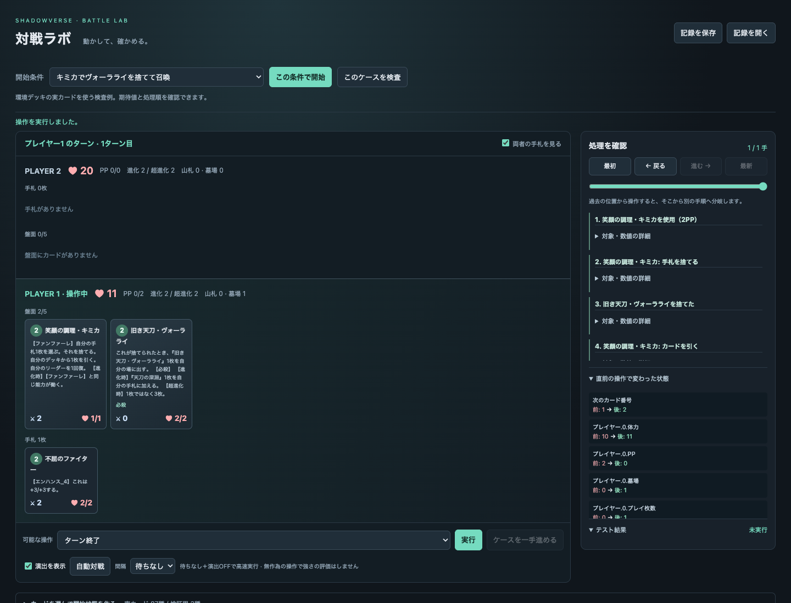

# 対戦ラボ

AIが操作できる対戦処理と、人が同じ局面を動かして調べる画面です。
ローカルDB内の**実カード87種と検証用カード3種**に対応します。
**ランプドラゴンとラストワードナイトメア**の公開40枚構築を、生成先・別形態を含めて収録しています。
未登録・能力本文が変更されたカードは、能力を省略して使うのではなく入力時に拒否します。

## 開く

```sh
python3 -m venv .venv
.venv/bin/pip install -e '.[dev]'
.venv/bin/python -m svdeck.battle_server --port 8767
```

[対戦ラボを開く](http://127.0.0.1:8767/)。この作業で確認した届け先もこのURLです。
外部には公開せず、起動したPCのブラウザから使います。実カードは既存の `data/cards.db` を読み取り専用で使います。
DBがない場合も検証用カードと54例のケースは動きます。

PCでは両者の手札・盤面と再生操作を一画面に表示します（表示領域1100×650以上）。
手札は青、盤面は緑の見出しと背景で区別します。カード名は金、攻撃力は橙、体力は桃、能力は紫で表示します。
色に加えて攻撃・体力の記号、手番の印、選択中の金枠を併用します。手札のフォロワーにも攻撃力／体力を表示します。
カードは名前・コスト・攻撃力／体力を短く表示し、クリックすると効果の全文と現在の状態を開きます。
長い処理履歴は右側の欄内でスクロールできます。条件編集・検査は右上の「条件・検査」にまとめています。
狭い分割画面ではページのスクロールを許容します。

- **条件・検査**を開き、**開始条件**からケースを選び、「この条件で開始」「ケースを一手進める」で観察できます。
- **このケースを検査**は、開始状態と操作列から再計算し、期待する終了状態と比べます。
- **開始条件**に環境2デッキの対戦を4通り用意しています。先攻後攻と同じデッキ同士も選べます。
  初期配布と先攻の通常ドロー後から始まります。自動対戦は合法手を無作為に選びます。
  学習済みの強い相手ではありません。
- **演出を表示**で攻撃・ダメージ・回復・登場・退場の簡易演出を切り替えます。
  OFFなら演出待ちはありません。OSの「動きを減らす」設定にも従います。
  戻る・別の開始条件・記録読込・演出OFFで進行中の演出を取り消せます。
  演出は確定済みの盤面へ重ねる表示で、途中の各瞬間の盤面を再計算するものではありません。
- **条件・検査 → カードを選んで開始状態を作る**でカード名検索、配置、除去、体力・PP・ターンの変更ができます。
  配置した条件が通常対戦で到達可能かは、この自由配置自体では証明しません。
- **処理を確認**に発動順と数値の変化を表示します。「対象・数値の詳細」を開くと正確な個体IDと値も見られます。
- **一試合のリプレイを開く**で、ランプドラゴン（先攻）対ラストワードナイトメア（後攻）の実行済み記録を開きます。
  全93手・両者11ターンの対戦を、開始状態から閲覧できます。操作は合法手から無作為に選んだもので、強さの評価用ではありません。
- **一手戻る／一手進む**で保存済みの操作を一手ずつ再生できます。進む時の演出はON/OFFを切り替えられます。
  **ターンへ移動**は先攻・後攻それぞれのターン開始へ直接移動し、演出を待ちません。
  「最初」「最後」と手数のスライダーも使えます。過去から別の操作を選ぶと新しい手順へ分岐します。
  元の手順も残したい場合は、分岐前に「記録を保存」を使ってください。
- **記録を保存／開く**は開始状態・操作列・カード定義・乱数の状態を含むJSONです。
  読込時には全操作を再実行して保存状態と照合し、開始状態を表示します。画面再読込では直前の再生位置を復元します。

再生例の再生成: `.venv/bin/python scripts/make_battle_replay.py`（対戦・行動選択のseedはともに14）。
配布記録は `src/svdeck/data/battle_example_replay.json` です。
今回の追加確認: 関連192テスト、ターン位置4検査、HTTPの読込・移動・不正入力8検査、型検査3ファイルがPASS。
届け先 `http://127.0.0.1:8767/` で、一手進む／戻る・先攻／後攻7ターンへの移動・終局・先頭復帰を操作し、表示の全状態を保存記録と照合しました。



[簡易演出の実行記録](evidence/battle-meta-animation.gif)

## AIから動かす

描画待ちもLLM呼び出しもないPythonの処理です。1行動で連鎖した効果を処理し、次の合法手を返します。

```python
from svdeck.battle import Battle
from svdeck.battle_decks import new_match

match = new_match('ramp-dragon', 'last-words-nightmare', seed=14)
battle = Battle(match.state, match.cards, record=False)
while battle.state['winner'] is None:
    player = battle.state['active_player']
    observation = battle.observation(player)
    action = observation['legal_actions'][0]  # ここをAIの選択へ置き換える
    battle.step(action)
```

`record=False` は処理履歴を保存しません。再生用の記録も残す場合は省略するか `record=True` にします。

`observation(player)` は相手の手札内容と両者の山札順、乱数の状態を隠します。
`state`、`step()`の戻り値、`export()`は検証・観戦用の全情報なので、対戦AIには渡さず
次の `observation()` を渡してください。学習アルゴリズムやPettingZooへの接続はまだ含みません。

`new_game([deck0, deck1], seed=14, mulligans=[[], []], format='unlimited')` で40枚の対戦を開始できます。
デッキはカードIDの文字列リスト、引き直しは初期4枚のうち0〜3の位置リストです。
同名3枚まで・単一クラス＋ニュートラル・トークン禁止・フォーマットを確認します。

## ケースの形式

```json
{
  "initial": {
    "players": [
      {"pp": 2, "max_pp": 2, "hand": [{"id": "h", "card_id": "test-damage-5"}]},
      {"board": [{"id": "e", "card_id": "test-body", "health": 6, "max_health": 6}]}
    ]
  },
  "actions": [{"type": "play", "card": "h", "target": "e"}],
  "expected": {
    "players": [
      {"pp": 0, "hand": [], "graveyard": 1},
      {"board": [{"id": "e", "health": 1, "max_health": 6}], "graveyard": 0}
    ]
  }
}
```

期待値は実行前に本文とルールから定めます。実装出力を正解へ転記しません。
辞書は**指定した項目**を比較し、配列は要素数と順番も比較します。維持されるべきPP・体力・手札なども
期待値に明記してください。省略項目は比較しません。期待値未入力での合格は認めません。
操作拒否を調べるケースは `expected_error: "ValueError"` と、変わらない状態を指定します。
このエラー指定は処理中のValueError全般に一致するので、特定の拒否理由を固定するなら文字列で指定します。

```sh
.venv/bin/python -m svdeck.battle test
.venv/bin/python -m svdeck.battle run case.json
.venv/bin/python -m svdeck.battle replay saved-battle.json
.venv/bin/python -m svdeck.battle search case.json --depth 5 --nodes 10000
.venv/bin/python -m svdeck.battle benchmark --games 100
.venv/bin/python -m svdeck.battle catalog
```

`search` は `expected` を満たす操作列を探します。`found` は保存した手順で再現できます。
`limit` は手数・探索件数の上限、`not_found` は調べた範囲で見つからなかった意味です。
指定乱数と両者の選択に依存する探索なので、相手の最善手に対する成立や実戦での到達頻度は保証しません。

## 実装と検査の範囲

- 共通処理：通常攻撃、守護・突進・疾走・バリア・必殺・ドレイン・潜伏・オーラ・威圧、進化と超進化、
  PP・エクストラPP・ターン交代、山札切れ、体力による勝敗。
- 宣言した効果：対象選択・全体・ランダムのダメージ、回復、強化、能力付与、破壊、消滅、手札戻し、
  ドロー、生成、召喚、PP最大値、プレイ枚数、墓場消費、効果進化、カウントダウン。
- 登録したカードのファンファーレ・進化時・超進化時・攻撃時・ラストワード、エンハンス、
  コンボ条件・スペルブーストによる軽減を同じ処理で動かします。
- モード選択、別々の対象選択、手札破棄、登場・進化・回復への反応、手札でのターン終了能力、
  リアニメイト、コピー、割りふるダメージ、結晶・アクセラレート、今回の2種のクレストにも対応します。
- 土の印、信仰、アクトなど、今回の2構築が使わない未対応能力も残っています。
  対応していない能力を持つ実カードは登録しません。全種類の誘発順の公式挙動を再現済みという意味ではありません。

対戦の境界と追加手順は[開発資料と設計](battle-development.md)へまとめています。
`battle.py` は状態と操作、`battle_rules.py` は共通の選択・発動・作用、
`battle_meta_cards.py` は環境カードの宣言、`battle_decks.py` と `battle_decks.json` は出典つき構築、
`battle_web/animation.js` は表示だけを担当します。

`battle_supported.json` はDB本文・数値・参照先能力の識別値です。能力変更後は登録を外し、
生成先を使う親カードも外します。定義とテストを直してから再登録します。カードDB全体は配布パッケージへ同梱しません。
保存記録には対戦ルール版 `battle-2` を保持し、旧版も再計算と保存状態が一致する場合だけ再生します。

### 確認結果（2026-09-14）

- 通常テスト: `.venv/bin/pytest tests --ignore=tests/temp -q` **397件PASS**。
  保存済みの過去の評価用ソース（`evals/`）と使い捨ての旧テストはこの対象へ含めません。
- 対戦の型検査11ファイルPASS。基本54例＋実カードの画面用5例、環境効果の独立検査71例を含みます。
- 2構築×先攻後攻の4組合せについて、40対戦・2,792操作が終局し、保存再生の結果も一致。
  恒久テストには8対戦で各手の記録ON/OFFの状態と合法手が一致する検査を追加しました。
- ブラウザで演出15群、実カード5例の検査、環境デッキ対戦の決着（68操作）を確認。
  演出ON/OFF、回復表示、攻撃、召喚、読込・巻き戻し時の取消を検査し、独立の目視もPASS。
- 描画なしの固定サンプル100対戦・4,400操作は約0.61秒（約7,200操作/秒）。環境デッキの平均速度ではありません。
- 配布パッケージを別の場所へ展開し、演出・デッキデータの同梱と、DBなしの54例PASSを確認しました。

### 出典と未確認の範囲

構築は2026-09-14に[ランプドラゴン](https://game8.jp/shadowverse-beyond/698541)・
[ラストワードナイトメア](https://game8.jp/shadowverse-beyond/811839)のレシピを公式デッキAPIと照合しました。
ランキング冒頭の文章とTier本文が一致しないため、当日のTier表本文を採用しています。
この2構築を収録しており、環境デッキ全種類の網羅ではありません。

公式の用語説明とカードQ&Aを根拠にしていますが、実機との全組合せ比較はしていません。
**捨てたときの能力と、元のファンファーレの後半との厳密な前後関係は公開資料では確認できませんでした。**
現状は元の能力を終えてから捨てたときの能力を実行し、全ての発動理由を記録します。
違和感が出た場合は保存記録から再現し、共通の発動順と回帰例を修正します。

追加ルールの参照：既存 `docs/rules.md` とDBキーワード、[公式ヘルプ](https://shadowverse-wb.com/ja/help?tab=tab0)。
人の確認作業を必須工程にせず、通常例と境界例をAIが作って検査します。ユーザーが違和感を指摘した局面は
保存記録から再現し、修正と自動テストへ追加します。

PC表示の追加確認: 1100×650、1280×720、1366×768、1440×900で、両者手札9枚・盤面5枚の全28枚、盤面の数値、操作ボタンが画面内に収まることを検査。ページの縦横は表示領域と一致。カード本文・条件編集を実際に開閉し、保存再生の4テストもPASS。

配色追加の確認: 同じ4サイズ・全28枚でカードと能力欄・数値の欠け0。能力本文の全文一致、カード詳細の開閉、再生結果の一致を確認。

退場表示の修正: フォロワーが消えるまで元の配置を保ち、退場完了後に残ったカードを左へ詰めます。
演出OFF・中断時は確定盤面を即時表示します。通常の退場、演出OFF、中断、退場後の召喚の
一時テスト4件と、既存の保存再生テスト4件がPASS。利用中の `http://127.0.0.1:8767/` で
検証用の5ダメージを実行し、退場中の配置維持・完了後の左詰め・演出OFFと途中取消の最終表示一致を確認しました。
独立した画像確認も3項目PASS（[退場中](evidence/battle-retirement-during.png)・[退場後](evidence/battle-retirement-after.png)）。
