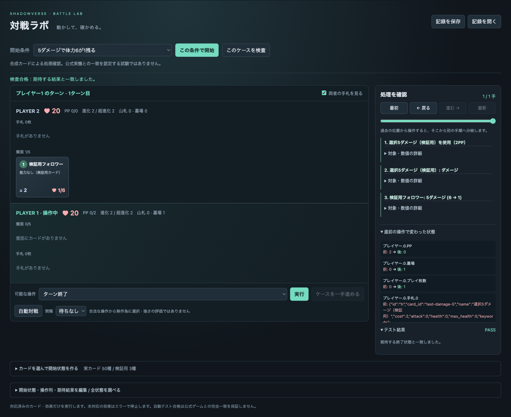

# 対戦ラボ

AIが操作できる対戦処理と、人が同じ局面を動かして調べる画面です。
初版はローカルDB内の**実カード50種と検証用カード3種**に対応します。全カード対応ではありません。
未登録・能力本文が変更されたカードは、能力を省略して使うのではなく入力時に拒否します。

## 開く

```sh
python3 -m venv .venv
.venv/bin/pip install -e '.[dev]'
.venv/bin/python -m svdeck.battle_server --port 8767
```

[対戦ラボを開く](http://127.0.0.1:8767/)。この作業で確認した届け先もこのURLです。
外部には公開せず、起動したPCのブラウザから使います。実カードは既存の `data/cards.db` を読み取り専用で使います。
DBがない場合も検証用カードと54例のケースは動きます。

- **開始条件**からケースを選び、「この条件で開始」「ケースを一手進める」で観察できます。
- **このケースを検査**は、開始状態と操作列から再計算し、期待する終了状態と比べます。
- **アンリミテッド・エルフ40枚同士**は合法40枚の対戦例です。初期配布と先攻の通常ドロー後から始まります。
  自動対戦は合法手を無作為に選びます。学習済みの強い相手ではありません。
- **カードを選んで開始状態を作る**でカード名検索、配置、除去、体力・PP・ターンの変更ができます。
  配置した条件が通常対戦で到達可能かは、この自由配置自体では証明しません。
- **処理を確認**に発動順と数値の変化を表示します。「対象・数値の詳細」を開くと正確な個体IDと値も見られます。
- **戻る／進む**で一手単位に再生できます。過去から別の操作を選ぶと新しい手順へ分岐します。
  元の手順も残したい場合は、分岐前に「記録を保存」を使ってください。
- **記録を保存／開く**は開始状態・操作列・カード定義・乱数の状態を含むJSONです。
  読込時には操作を再実行し、保存された状態と一致するか確認します。画面再読込でも直前の記録を復元します。



## AIから動かす

描画待ちもLLM呼び出しもないPythonの処理です。1行動で連鎖した効果を処理し、次の合法手を返します。

```python
from svdeck.battle import Battle, demo_state

battle = Battle(demo_state(), record=False)
while battle.state['winner'] is None:
    player = battle.state['active_player']
    observation = battle.observation(player)
    action = observation['legal_actions'][0]  # ここをAIの選択へ置き換える
    battle.step(action)
```

`record=False` は処理履歴を保存しません。再生用の記録も残す場合は省略するか `record=True` にします。

`observation(player)` は相手の手札内容と両者の山札順、乱数の状態を隠します。
`state`、`step()`の戻り値、`export()`は検証・観戦用の全情報なので、対戦AIには渡さず
次の `observation()` を渡してください。学習アルゴリズムやPettingZooへの接続はまだ含みません。

`new_game([deck0, deck1], seed=14, mulligans=[[], []], format='unlimited')` で40枚の対戦を開始できます。
デッキはカードIDの文字列リスト、引き直しは初期4枚のうち0〜3の位置リストです。
同名3枚まで・単一クラス＋ニュートラル・トークン禁止・フォーマットを確認します。

## ケースの形式

```json
{
  "initial": {
    "players": [
      {"pp": 2, "max_pp": 2, "hand": [{"id": "h", "card_id": "test-damage-5"}]},
      {"board": [{"id": "e", "card_id": "test-body", "health": 6, "max_health": 6}]}
    ]
  },
  "actions": [{"type": "play", "card": "h", "target": "e"}],
  "expected": {
    "players": [
      {"pp": 0, "hand": [], "graveyard": 1},
      {"board": [{"id": "e", "health": 1, "max_health": 6}], "graveyard": 0}
    ]
  }
}
```

期待値は実行前に本文とルールから定めます。実装出力を正解へ転記しません。
辞書は**指定した項目**を比較し、配列は要素数と順番も比較します。維持されるべきPP・体力・手札なども
期待値に明記してください。省略項目は比較しません。期待値未入力での合格は認めません。
操作拒否を調べるケースは `expected_error: "ValueError"` と、変わらない状態を指定します。
このエラー指定は処理中のValueError全般に一致するので、特定の拒否理由を固定するなら文字列で指定します。

```sh
.venv/bin/python -m svdeck.battle test
.venv/bin/python -m svdeck.battle run case.json
.venv/bin/python -m svdeck.battle replay saved-battle.json
.venv/bin/python -m svdeck.battle search case.json --depth 5 --nodes 10000
.venv/bin/python -m svdeck.battle benchmark --games 100
.venv/bin/python -m svdeck.battle catalog
```

`search` は `expected` を満たす操作列を探します。`found` は保存した手順で再現できます。
`limit` は手数・探索件数の上限、`not_found` は調べた範囲で見つからなかった意味です。
指定乱数と両者の選択に依存する探索なので、相手の最善手に対する成立や実戦での到達頻度は保証しません。

## 実装と検査の範囲

- 共通処理：通常攻撃、守護・突進・疾走・バリア・必殺・ドレイン・潜伏・オーラ・威圧、進化と超進化、
  PP・エクストラPP・ターン交代、山札切れ、体力による勝敗。
- 宣言した効果：対象選択・全体・ランダムのダメージ、回復、強化、能力付与、破壊、消滅、手札戻し、
  ドロー、生成、召喚、PP最大値、プレイ枚数、墓場消費、効果進化、カウントダウン。
- 登録したカードのファンファーレ・進化時・超進化時・攻撃時・ラストワード、エンハンス、
  コンボ条件・スペルブーストによる軽減を同じ処理で動かします。
- クレスト、土の印、信仰、複数モード・複数の選択対象、アクトなどは初版の対応範囲外です。
  対応していない能力を持つ実カードは登録しません。全種類の誘発順の公式挙動を再現済みという意味ではありません。

コードは `battle.py`（状態と操作）、`battle_cards.py`（明示した対応カード）、`battle_server.py` と
`battle_web/`（確認画面）です。`battle_supported.json` に確認時のDB本文・数値の識別値を保持します。
能力変更後は登録を自動的に外し、定義とテストを直してから再登録します。カードDB全体は同梱しません。

2026-09-14確認：54保存ケース、実カード連鎖10例、状態保存・探索・デッキ制約などを含む102検査が合格。
既存機能も含む全311検査が合格し、関連6ファイルの型検査も合格しました。
配布用パッケージを別の場所に展開し、カードDBなしでも54保存ケースが合格することを確認しました。
ブラウザでは開始状態の編集、実カード使用、バリア、再生・分岐、保存・読込、誤った期待値の不合格、
自動対戦の決着を確認。目視では5ダメージ後の体力1/6、PP0/2、処理順と合格表示を確認しました。
描画なしの固定サンプル100対戦・4,400操作は約0.51秒（約8,700操作/秒）。計算機・局面・記録有無で変わります。

追加ルールの参照：既存 `docs/rules.md` とDBキーワード、[公式ヘルプ](https://shadowverse-wb.com/ja/help?tab=tab0)。
人の確認作業を必須工程にせず、通常例と境界例をAIが作って検査します。ユーザーが違和感を指摘した局面は
保存記録から再現し、修正と自動テストへ追加します。
