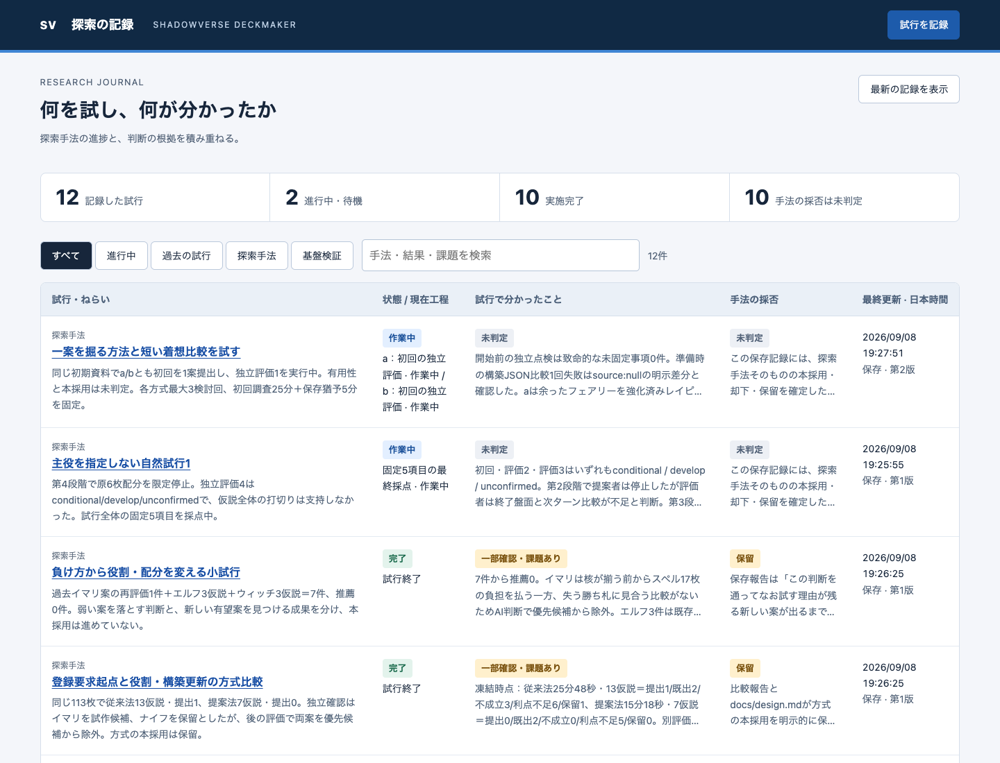
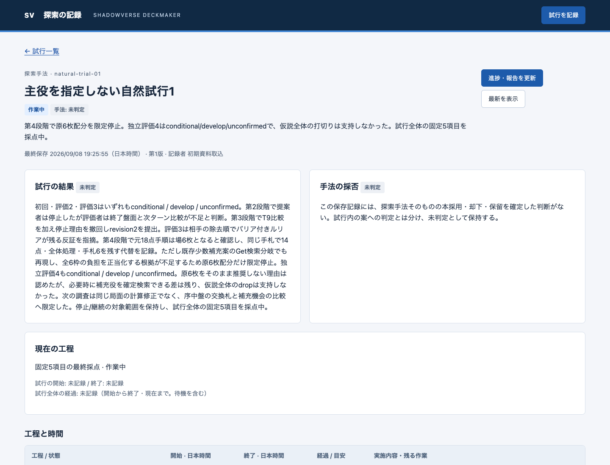
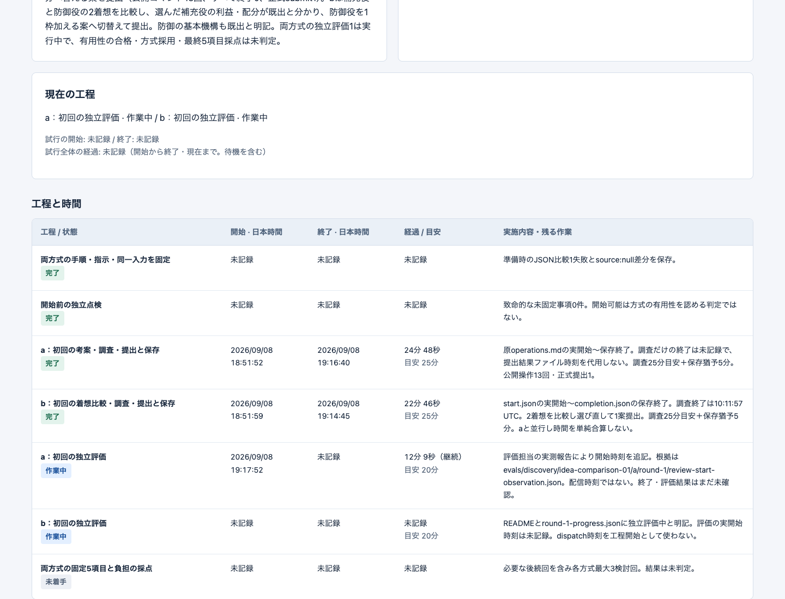
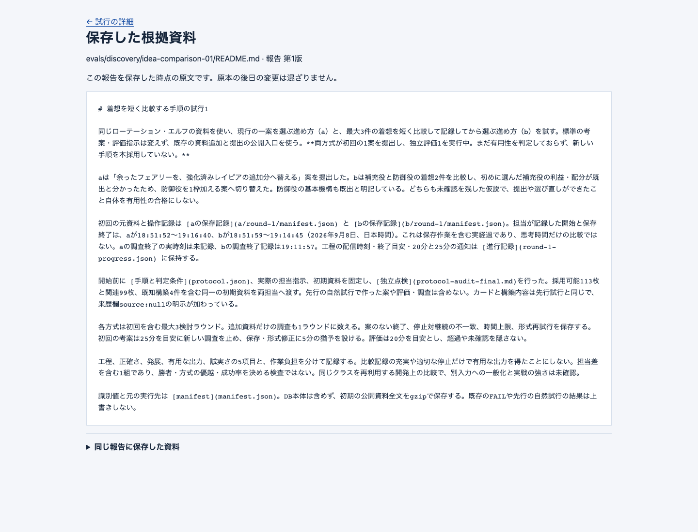

# 検証記録画面の確認

2026-09-08。探索方式の成功評価ではなく、記録画面と保存入口の実装検証。

## 確認した範囲

- 正常系: 実記録12件の一覧→進行中→工程時刻→過去のFAIL→結果/採否理由→保存根拠。画面から登録→開始→終了→再読込。元担当のCLI実更新→本体の画面へ反映。
- 境界: 未記録時刻、マイクロ秒を含む未編集日時、並行工程、試行全体と工程の状態、空欄、別rootでの復元。
- エラー: 古い版による競合、並行する保存応答、不正日時、資料領域外の参照、存在しない資料、未来/逆転日時、外部ページからのHTTP更新、バックアップ上書き。

既存178件と、今回の保存・HTTP・CLIの19件を確認。`tests/temp` は除外。
`mypy --follow-imports=silent` は新しいPython2ファイルに問題なし。JavaScript構文検査に問題なし。
配布用wheelを作成し、Python入口、保存処理、HTML/CSS/JavaScript、カタログの6ファイルを含むことを確認。

## 実利用の証拠

本体台帳: `/Users/miyauchitsubasa/Desktop/github/shadowverse-deckmaker/data/experiments.sqlite3`。
確認URL: `http://127.0.0.1:8765/`。Python標準ライブラリのみでローカル提供する。
書込み操作試験は分離した `/tmp/sv-journal-ui-check.sqlite3` で実施し、仮の記録は本体へ入れていない。

- [一覧と詳細の操作結果](sv-journal-browser-result.json): 実記録12件、進行中2件、工程の日本時間、未記録の総経過、FAILと未判定の分離、狭幅、ページエラー0件。
- [画面での保存結果](sv-journal-ui-write-result.json): 登録・開始・終了・結果と採否を画面から保存し、再読込後に第3版と履歴3件を確認。未編集の .000519 / .100519 の日時精度を保持。
- [過去版と根拠の操作結果](sv-journal-evidence-result.json): 第1版をクリックし、その版に保存したREADME原文を確認。
- 元の探索担当が `idea-comparison-01` の `arm-a-review-1` をCLIから更新。開始時刻 `2026-09-08T10:17:52+00:00` が第2版に保存され、画面で日本時間19:17:52を確認した。元根拠は同試行の `a/round-1/review-start-observation.json`。
- [バックアップ検証](backup-verification.json): 本体台帳12件と最新版の根拠279参照がコピー先から一致して読み出せることを確認。別rootへのCLI復元と原本なしの根拠閲覧は自動テストで確認。

画像と実操作記録を、実装経緯を渡していない別担当が確認。最初は根拠・履歴部分の画像不足でNEEDS_REVIEW、実際に過去版と原文を開いた証拠を追加後、全7項目PASS。初見の手順確認で不足したインストールコマンドも追記した。

## 修正して再確認した問題

- 日時入力欄のブラウザによる末尾ゼロ正規化で、触っていないマイクロ秒が失われる問題。正規化後の初期値と比較し、未編集の元値を維持。
- 未着手の試行に作業中工程、完了した試行に未着手工程が残る問題。保存時に不整合を拒否。
- 保存直後に他担当が保存すると、保存応答が他担当の版を返す問題。本人が確定した版番号へ固定。
- Pythonだけが受理する省略形式の日時を画面が表示できない問題。公開入力をタイムゾーン付きの拡張形式に限定。
- 一覧行の定期更新後、上部の件数が以前の値のままになる問題。行と件数を同じ取得結果から更新。
- 過去版の作業中工程も現在までの経過を表示する問題。その版の保存日時で計算を止め、「保存時点」と表示。[実画面での確認](historical-duration.json)を保存。

ブラウザ共有プロファイルが使用中だったため、利用者のブラウザには触れず、独立したheadless Chromeで検証した。
配布検査の初回は環境にsetuptoolsがないため失敗し、通常の分離ビルド環境で再実行して成功。
画面は保存された進捗を表示するもので、実行プロセスを監視して稼働を保証するものではない。
初期登録の出典と取得時点は [catalog-provenance.json](catalog-provenance.json) に残す。
